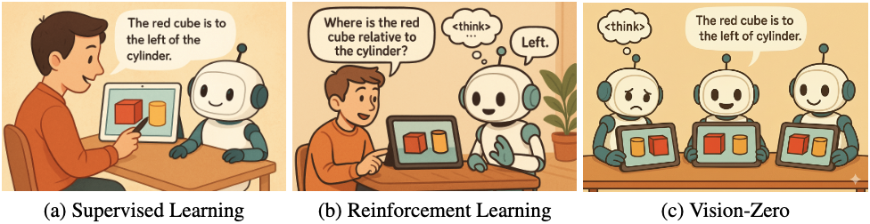

<div align="center">

# 🎯 Vision-Zero
### Scalable VLM Self-Improvement via Strategic Gamified Self-Play

> **🎉 Accepted to ICLR 2026!**

[](https://arxiv.org/abs/2509.25541)
[](LICENSE)
[](https://huggingface.co/Qinsi1)
[](https://huggingface.co/datasets/Qinsi1/Vision-Zero-clevr-dataset)



*A domain-agnostic framework enabling VLM self-improvement through competitive visual games*

</div>

## 📋 Table of Contents

- [🎯 Overview](#-overview)
- [📊 Performance Results](#-performance-results)
- [🚀 Quick Start](#-quick-start)
- [🤖 Models & Dataset](#-models--dataset)
- [🛠️ Setup](#️-setup)
- [💪 Training](#-training)
- [📊 Evaluation](#-evaluation)
- [📄 Citation](#-citation)

---

## 🎯 Overview

Although reinforcement learning (RL) can effectively enhance the reasoning capabilities of vision–language models (VLMs), current methods remain heavily dependent on labor-intensive datasets that require extensive manual construction and verification, leading to extremely high training costs and consequently constraining the practical deployment of VLMs. 

To address this challenge, we propose **Vision-Zero**, *a domain-agnostic framework enabling VLM self-improvement through competitive visual games generated from arbitrary image pairs.*

> 🏆 **Achievement:** Despite using label-free data, Vision-Zero achieves state-of-the-art performance on reasoning, chart question answering, and vision-centric understanding tasks, surpassing other annotation-based methods.

---

## 📊 Performance Results

### 🎖️ Key Achievements

| Metric | Result | Significance |
|--------|--------|--------------|
| **Training Data** | 0 human annotations | First zero-human-in-the-loop VLM training paradigm |
| **vs SOTA (ViGaL)** | +3.4% average | Outperforms best curated-data method |
| **vs GPT-4o** | Competitive | Matches/exceeds on chart & OCR tasks |
| **InfoVQA** | +4.2% gain | Largest improvement on chart understanding |
| **MMVP** | +2.7% gain | Enhanced visual perception capabilities |
| **Generalization** | 3 domains | Works on CLEVR, Charts, Real-World images |

### 📊 OCR and Chart Understanding Tasks

Vision-Zero demonstrates exceptional performance on OCR, chart, and document understanding tasks, with the Chart-trained variant showing particularly strong improvements:

| Model | AI2D | ChartQA | TextVQA | DocVQA | InfoVQA | OCRBench | SEEDBench2 | Average |
|-------|------|---------|---------|--------|---------|----------|------------|---------|
| **Qwen2.5-VL-7B (Baseline)** | 84.7 | 86.1 | 85.5 | 94.8 | 82.3 | 88.3 | 70.4 | 84.6 |
| **+ Vision-Zero (CLEVR)** | 84.5 | **86.3** | 85.3 | **94.9** | **82.5** | 88.1 | 69.5 | 84.4 |
| **+ Vision-Zero (Chart)** | **85.8** | **87.2** | **86.4** | **95.9** | **86.5** | **89.0** | **70.9** | **85.9** |
| **+ Vision-Zero (Real-World)** | 84.8 | **86.3** | 85.4 | **95.2** | 82.3 | **88.5** | 69.8 | 84.6 |
| **GPT-4o** | 84.4 | 85.7 | 82.2 | 91.1 | 78.2 | 73.9 | 72.0 | 81.1 |

> **Key Insight:** Vision-Zero (Chart) achieves **+4.2% improvement on InfoVQA** and outperforms GPT-4o on most benchmarks, demonstrating that label-free self-play can surpass both supervised baselines and proprietary models.

### 🎯 Vision-Centric Understanding Tasks

Vision-Zero shows consistent improvements on tasks requiring fine-grained visual reasoning:

| Model | RealWorldQA | MMVP | MMStar | BLINK | MuirBench | CRPE | Average |
|-------|-------------|------|--------|-------|-----------|------|---------|
| **Qwen2.5-VL-7B (Baseline)** | 68.1 | 76.8 | 64.6 | 55.2 | 58.2 | 76.4 | 66.6 |
| **+ Vision-Zero (CLEVR)** | 68.5 | **79.2** | **65.2** | **57.2** | **59.4** | **76.9** | **67.7** |
| **+ Vision-Zero (Chart)** | 68.2 | 77.9 | 64.7 | 56.1 | 58.6 | 76.2 | 66.9 |
| **+ Vision-Zero (Real-World)** | **68.5** | **79.5** | **65.8** | **57.5** | **59.8** | **77.0** | **68.0** |
| **GPT-4o** | 75.4 | 86.3 | - | 68.0 | 68.0 | - | - |

**Improvements over baseline:**
- **MMVP:** +2.7% (Real-World) - Better visual perception
- **BLINK:** +2.3% (Real-World) - Enhanced visual reasoning
- **Average:** +1.4% gain with zero human annotations

> **Remarkable Achievement:** Vision-Zero (Real-World) achieves **68.0% average** across vision-centric tasks, representing the **best performance among all 7B open-source models** trained with reasoning-focused methods.

### 🚀 Comparison with State-of-the-Art Methods

Vision-Zero outperforms other recent VLM reasoning methods trained on Qwen2.5-VL-7B:

| Method | Training Data | AI2D | ChartQA | RealWorldQA | MMVP | Average |
|--------|---------------|------|---------|-------------|------|---------|
| R1-OneVision-7B | Curated | 82.2 | - | 58.0 | 61.3 | - |
| MM-Eureka-Qwen-7B | Curated | 84.1 | 77.3 | 66.1 | 74.3 | 75.5 |
| VLAA-Thinker-7B | Curated | 84.0 | 84.3 | 65.4 | 71.6 | 76.3 |
| OpenVLThinker-7B | Curated | 81.8 | - | 60.2 | 71.3 | - |
| ViGaL-Snake+Rotation | Curated | 84.5 | 79.9 | 66.5 | 74.6 | 76.4 |
| **Vision-Zero (CLEVR)** | **Label-Free** | **84.5** | **86.3** | **68.5** | **79.2** | **79.6** |
| **Vision-Zero (Chart)** | **Label-Free** | **85.8** | **87.2** | **68.2** | **77.9** | **79.8** |
| **Vision-Zero (Real-World)** | **Label-Free** | **84.8** | **86.3** | **68.5** | **79.5** | **79.8** |

> **Zero-Annotation Superiority:** Despite using **no human-labeled data**, Vision-Zero variants achieve **+3.4% average improvement** over the best competing method (ViGaL), demonstrating the power of strategic self-play for VLM training.

---

### ✨ Key Features

<details>
<summary><b>🎮 Strategic Self-Play Framework</b></summary>

Vision-Zero trains VLMs in "Who Is the Spy"-style games, where the models engage in strategic reasoning and actions across multiple roles. Through interactive gameplay, models autonomously generate their training data without human annotation.

</details>

<details>
<summary><b>🖼️ Gameplay from Arbitrary Images</b></summary>

Unlike existing gamified frameworks, Vision-Zero can generate games from arbitrary images, thereby enhancing the model's reasoning ability across diverse domains and showing strong generalization to different tasks. We demonstrate this versatility using three distinct types of image datasets: CLEVR-based synthetic scenes, charts, and real-world images.

</details>

<details>
<summary><b>📈 Sustainable Performance Gain</b></summary>

We introduce Iterative Self-Play Policy Optimization (Iterative-SPO), a novel training algorithm that alternates between Self-Play and reinforcement learning with verifiable rewards (RLVR), mitigating the performance plateau often seen in self-play-only training and achieving sustained long-term improvements.

</details>


### 🎉 Current Release Status

| Component | Status | Description |
|-----------|---------|-------------|
| 🤖 **Models** | ✅ Available | Trained models on Qwen2.5-VL-7B, InternVL3-8B, InternVL3-14B |
| 📊 **CLEVR Dataset** | ✅ Available | Complete CLEVR-based training dataset |
| 🛠️ **Training Code** | ✅ Available | Full open-source training pipeline |
| 📈 **Chart Dataset** | ✅ Available | Chart-based dataset for enhanced reasoning |
| 🌍 **Real-World Dataset** | ✅ Available | Real-world image dataset for diverse scenarios |

---

## 🚀 Quick Start

```bash
# 1. Clone the repository
git clone https://github.com/wangqinsi1/Vision-Zero.git
cd vision-zero

# 2. Set up environment
conda create -n vision-zero python=3.10
conda activate vision-zero
bash setup.sh

# 3. Download a Trained model
# Choose from available models in the table below

# 4. Start training or inference
bash run_scripts/run_grpo_vision_zero.sh
```


## 🤖 Models & Dataset

### 🔬 Trained Models


| Model Family | Size | Dataset | HuggingFace Link |
|--------------|------|---------|------------------|
| **Qwen2.5-VL** | 7B | CLEVR | [](https://huggingface.co/Qinsi1/Vision-Zero-Qwen-2.5-VL-7B-Clevr) |
| **Qwen2.5-VL** | 7B | Chart | [](https://huggingface.co/Qinsi1/Vision-Zero-Qwen-2.5-VL-7B-Chart) |
| **Qwen2.5-VL** | 7B | Real-World | [](https://huggingface.co/Qinsi1/Vision-Zero-Qwen-2.5-VL-7B-RealWorld) |
| **InternVL3** | 8B | CLEVR | [](https://huggingface.co/Qinsi1/Vision-Zero-InternVL3-8B-Clevr) |
| **InternVL3** | 14B | CLEVR | [](https://huggingface.co/Qinsi1/Vision-Zero-InternVL3-14B-Clevr) |


### 📊 Datasets

| Dataset Type | Description | Link |
|--------------|-------------|------|
| **CLEVR-based** | Synthetic scenes for logical reasoning | [](https://huggingface.co/datasets/Qinsi1/Vision-Zero-clevr-dataset) |
| **Chart-based** | Chart data for document understanding | [](https://huggingface.co/datasets/Qinsi1/Vision-Zero-chart-dataset) |
| **RealWorld** | Real-world image data | [](https://huggingface.co/datasets/Qinsi1/Vision-Zero-realworld-dataset) |


## 🛠️ Setup

> 📢 **Acknowledgment:** This repo is based on [`vlm-r1`](https://github.com/om-ai-lab/VLM-R1) - thanks for their contribution!

### Prerequisites
- Python 3.10+
- CUDA-compatible GPU (recommended)
- Conda or similar environment manager

### Installation

```bash
# Create and activate environment
conda create -n vision-zero python=3.10
conda activate vision-zero

# Install dependencies
bash setup.sh
```

## 💪 Training

### 📋 Training Pipeline

#### Step 1: 📁 Prepare Dataset and Model

Download one of the available datasets or prepare your own:
- **CLEVR-based**: Available now ✅
- **Chart-based**: Available now ✅
- **Real-World**: Available now ✅

Configure your training setup in `run_scripts/run_grpo_vision_zero.sh`:

```bash
# Configuration variables
IMAGES_DIR=$IMAGES_DIR          # Path to your images
SCENES_DIR=$SCENES_DIR          # Path to scene descriptions  
MODEL=$MODEL                    # Base model to fine-tune
OUTPUT_BASE_DIR=$OUTPUT_DIR     # Output directory for checkpoints
RUN_NAME="your_run_name"        # Experiment name
```

#### Step 2: 🚀 Start Training

Launch the training process with customizable hyperparameters:

```bash
bash run_scripts/run_grpo_vision_zero.sh
```

> 💡 **Tip:** All hyperparameters can be modified directly in the script file.

#### Step 3: 📊 Evaluation

Evaluate your trained model on out-of-distribution tasks using [VLMEvalKit](https://github.com/open-compass/VLMEvalKit):

```bash
# After training completes and checkpoint is saved
# Use VLMEvalKit for comprehensive evaluation
```

---

## 📊 Evaluation

We use [VLMEvalKit](https://github.com/open-compass/VLMEvalKit) for comprehensive model evaluation on out-of-distribution tasks, ensuring robust performance assessment across various benchmarks.

---

## 📄 Citation

If you find Vision-Zero useful in your research, please consider citing our paper:

```bibtex
@misc{wang2025visionzeroscalablevlmselfimprovement,
    title={Vision-Zero: Scalable VLM Self-Improvement via Strategic Gamified Self-Play}, 
    author={Qinsi Wang and Bo Liu and Tianyi Zhou and Jing Shi and Yueqian Lin and Yiran Chen and Hai Helen Li and Kun Wan and Wentian Zhao},
    year={2025},
    eprint={2509.25541},
    archivePrefix={arXiv},
    primaryClass={cs.CV},
    url={https://arxiv.org/abs/2509.25541}
}
```

---

<div align="center">

**🌟 Star this repo if you find it helpful!**

*Made with ❤️ by the Vision-Zero team*

</div>
